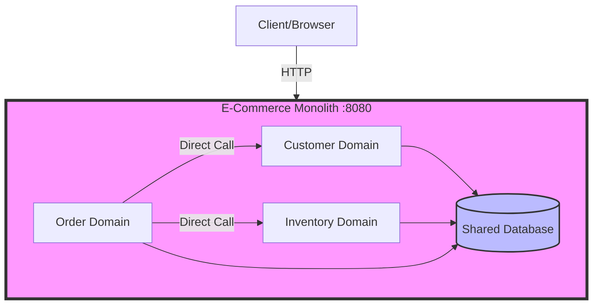
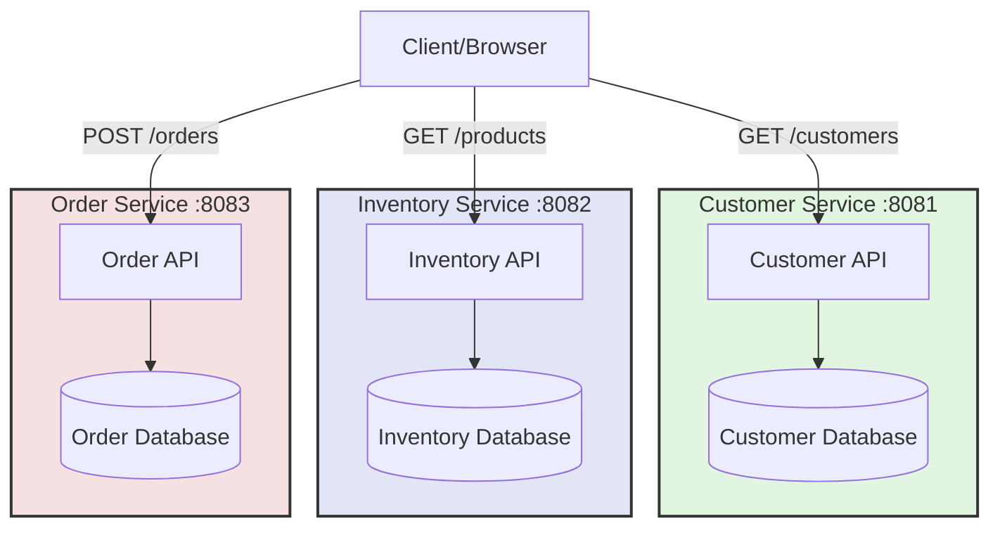
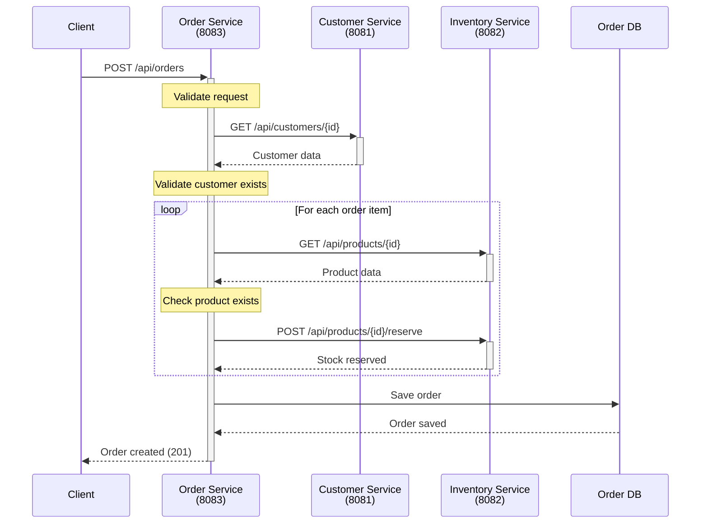
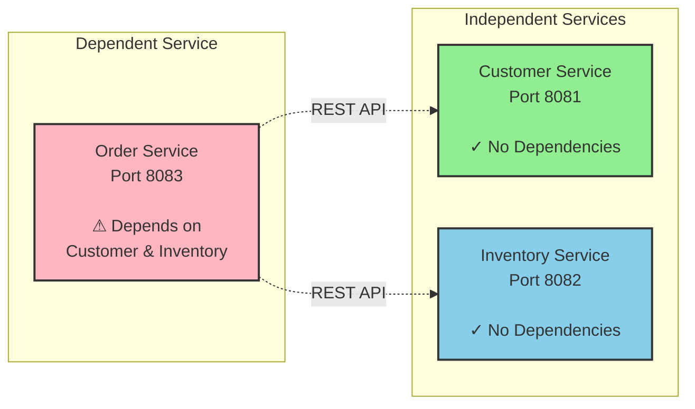
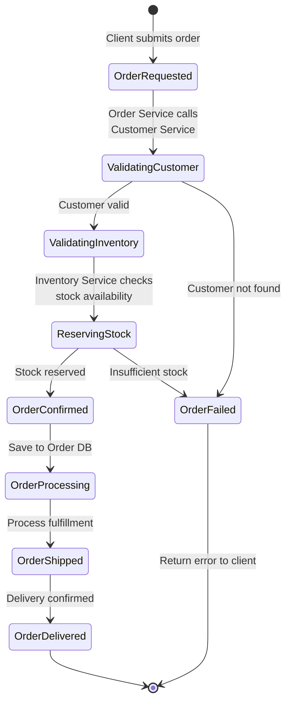
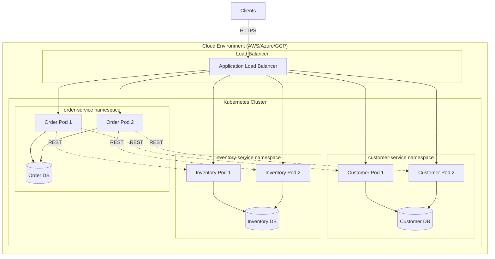
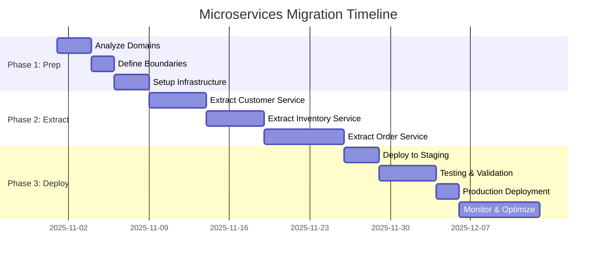

# Architecture Diagrams

This document contains visual representations of the monolith-to-microservices transformation.

## Table of Contents
- [Current Monolithic Architecture](#current-monolithic-architecture)
- [Target Microservices Architecture](#target-microservices-architecture)
- [Service Communication Flow](#service-communication-flow)
- [Order Creation Sequence](#order-creation-sequence)

---

## Current Monolithic Architecture

### ASCII Diagram

```
┌────────────────────────────────────────────────────────┐
│                  E-Commerce Monolith                   │
│                    (Port 8080)                         │
│                                                        │
│  ┌──────────────┐  ┌──────────────┐  ┌──────────────┐  |
│  │   Customer   │  │  Inventory   │  │    Order     │  │
│  │    Domain    │  │    Domain    │  │    Domain    │  │
│  └──────────────┘  └──────────────┘  └──────────────┘  │
│         │                 │                  │         │
│         └─────────────────┴──────────────────┘         │
│                           │                            │
│                  ┌────────▼────────┐                   │
│                  │  Shared H2 DB   │                   │
│                  │ (ecommercedb)   │                   │
│                  └─────────────────┘                   │
└────────────────────────────────────────────────────────┘
```

### Mermaid Diagram



---

## Target Microservices Architecture

### ASCII Diagram

```
                        ┌─────────────────┐
                        │  Client/Browser │
                        └────────┬────────┘
                                 │
                    ┌────────────┼────────────┐
                    │            │            │
                    ▼            ▼            ▼
         ┌──────────────┐  ┌──────────────┐  ┌──────────────┐
         │   Customer   │  │  Inventory   │  │    Order     │
         │   Service    │  │   Service    │  │   Service    │
         │  (Port 8081) │  │ (Port 8082)  │  │ (Port 8083)  │
         └──────┬───────┘  └──────┬───────┘  └──────┬───────┘
                │                 │                  │
                │                 │                  │
         ┌──────▼───────┐  ┌──────▼───────┐  ┌──────▼───────┐
         │ Customer DB  │  │ Inventory DB │  │  Order DB    │
         │   (H2/SQL)   │  │   (H2/SQL)   │  │   (H2/SQL)   │
         └──────────────┘  └──────────────┘  └──────────────┘
```

### Mermaid Diagram



---

## Service Communication Flow

### ASCII Diagram - Order Processing

```
                             Order Creation Flow
                             
    Client                Order Service         Customer Service    Inventory Service
      │                      (8083)                  (8081)              (8082)
      │                        │                       │                   │
      │   POST /orders         │                       │                   │
      ├───────────────────────>│                       │                   │
      │                        │                       │                   │
      │                        │  GET /customers/{id}  │                   │
      │                        ├──────────────────────>│                   │
      │                        │                       │                   │
      │                        │   Customer Data       │                   │
      │                        │<──────────────────────┤                   │
      │                        │                       │                   │
      │                        │          GET /products/{id}               │
      │                        ├───────────────────────────────────────────>│
      │                        │                       │                   │
      │                        │              Product Data                 │
      │                        │<───────────────────────────────────────────┤
      │                        │                       │                   │
      │                        │      POST /products/{id}/reserve          │
      │                        ├───────────────────────────────────────────>│
      │                        │                       │                   │
      │                        │           Stock Reserved                  │
      │                        │<───────────────────────────────────────────┤
      │                        │                       │                   │
      │                        │  Save Order           │                   │
      │                        │  to Order DB          │                   │
      │                        │                       │                   │
      │   Order Created        │                       │                   │
      │<───────────────────────┤                       │                   │
      │                        │                       │                   │
```

### Mermaid Sequence Diagram



---

## Service Dependency Map

### ASCII Diagram

```
┌─────────────────────────────────────────────────────────────┐
│                    Service Dependencies                      │
└─────────────────────────────────────────────────────────────┘

    Customer Service               Inventory Service
    ┌──────────────┐              ┌──────────────┐
    │   Port 8081  │              │  Port 8082   │
    │              │              │              │
    │ - GET /      │              │ - GET /      │
    │   customers  │              │   products   │
    │ - POST /     │              │ - POST /     │
    │   customers  │              │   reserve    │
    │ - PUT /      │              │ - POST /     │
    │   customers  │              │   restore    │
    └──────▲───────┘              └──────▲───────┘
           │                             │
           │                             │
           └──────────┬──────────────────┘
                      │
                ┌─────▼──────┐
                │   Order    │
                │  Service   │
                │ Port 8083  │
                │            │
                │ Depends on │
                │   both     │
                └────────────┘
```

### Mermaid Component Diagram



---

## Data Flow - Complete Order Lifecycle

### Mermaid State Diagram



---

## Deployment Architecture

### Mermaid Deployment Diagram



---

## Migration Phases

### ASCII Timeline

```
Phase 1: Preparation          Phase 2: Extraction         Phase 3: Migration
─────────────────────────────────────────────────────────────────────────────

┌──────────────┐              ┌──────────────┐            ┌──────────────┐
│   Monolith   │              │  Monolith +  │            │ Pure Micro-  │
│              │    ──────>   │ Microservices│  ──────>   │  services    │
│   All-in-One │              │   (Hybrid)   │            │ Architecture │
└──────────────┘              └──────────────┘            └──────────────┘

• Analyze domains             • Extract Customer           • Decomission
• Define boundaries           • Extract Inventory            monolith
• Setup infrastructure        • Extract Order              • Full cloud
• Create repositories         • Parallel run                 deployment
                              • Data migration             • Service mesh
```

### Mermaid Gantt Chart



---

## Technology Stack

```
┌─────────────────────────────────────────────────────────────┐
│                     Technology Stack                         │
├─────────────────────────────────────────────────────────────┤
│                                                             │
│  Application Layer                                          │
│  ┌──────────────────────────────────────────────────────┐  │
│  │ Spring Boot 3.2.0 | Java 17 | Maven                 │  │
│  └──────────────────────────────────────────────────────┘  │
│                                                             │
│  API Layer                                                  │
│  ┌──────────────────────────────────────────────────────┐  │
│  │ REST APIs | Spring Web MVC | JSON                    │  │
│  └──────────────────────────────────────────────────────┘  │
│                                                             │
│  Data Layer                                                 │
│  ┌──────────────────────────────────────────────────────┐  │
│  │ Spring Data JPA | Hibernate | H2 Database            │  │
│  └──────────────────────────────────────────────────────┘  │
│                                                             │
│  Development Tools                                          │
│  ┌──────────────────────────────────────────────────────┐  │
│  │ Lombok | Spring DevTools | GitHub Copilot            │  │
│  └──────────────────────────────────────────────────────┘  │
│                                                             │
└─────────────────────────────────────────────────────────────┘
```

---

## Quick Reference

### Service Ports Summary

| Service | Port | Database | Dependencies |
|---------|------|----------|--------------|
| **Customer Service** | 8081 | customer_db | None |
| **Inventory Service** | 8082 | inventory_db | None |
| **Order Service** | 8083 | order_db | Customer, Inventory |
| **Monolith (Current)** | 8080 | ecommercedb | N/A |

### API Endpoints Summary

```
Customer Service (8081)
├── GET    /api/customers
├── GET    /api/customers/{id}
├── POST   /api/customers
├── PUT    /api/customers/{id}
└── DELETE /api/customers/{id}

Inventory Service (8082)
├── GET    /api/products
├── GET    /api/products/{id}
├── POST   /api/products
├── PUT    /api/products/{id}
├── POST   /api/products/{id}/reserve
└── POST   /api/products/{id}/restore

Order Service (8083)
├── GET    /api/orders
├── GET    /api/orders/{id}
├── POST   /api/orders
├── PUT    /api/orders/{id}/cancel
└── PUT    /api/orders/{id}/status
```

---

## Notes for Presenters

### Diagram Usage Tips

1. **Start with ASCII diagrams** for quick terminal/console demonstrations
2. **Use Mermaid diagrams** in markdown viewers, GitHub, and documentation
3. **Print this document** as a reference during live coding sessions
4. **Keep the Service Dependency Map** visible to explain coupling issues

### Key Discussion Points

- **Current State**: Highlight the tight coupling in the monolith
- **Target State**: Emphasize service independence and scalability
- **Communication**: Show how REST APIs replace direct method calls
- **Data**: Explain database-per-service pattern
- **Trade-offs**: Discuss complexity vs. scalability

### Demo Flow with Diagrams

1. Show **Current Monolithic Architecture** (slide 1)
2. Explain problems with tight coupling
3. Present **Target Microservices Architecture** (slide 2)
4. Walk through **Service Communication Flow** (slide 3)
5. Detail **Order Creation Sequence** for deep dive
6. Review **Migration Phases** timeline

---

## Additional Resources

- **DEMO_SCRIPT.md** - Complete presentation script with timing
- **ARCHITECTURE.md** - Detailed architectural decisions
- **COPILOT_PROMPTS.md** - Prompts to generate these services
- **API_EXAMPLES.md** - Test the current monolith APIs

---

*Generated for the E-Commerce Monolith to Microservices Demo*  
*Use GitHub Copilot to transform the monolith into these microservices!*
